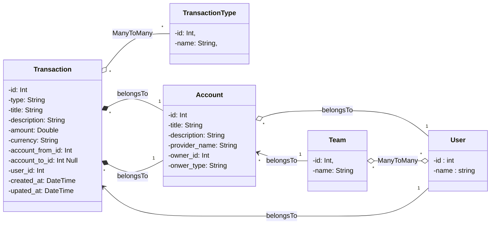

## Architecture

```mermaid
classDiagram
  direction RL

  class Account {
    -id: Int
    -title: String
    -description: String
    -provider_name: String
    -owner_id: Int
    -onwer_type: String
  }
  
  class Transaction {
    -id: Int
    -type: String
    -title: String
    -description: String
    -amount: Double
    -currency: String
    -account_from_id: Int
    -account_to_id: Int Null
    -user_id: Int
    -created_at: DateTime
    -upated_at: DateTime
  }
  
  class User {
    -id : int
    -name : string
  }
  
  class TransactionType {
    -id: Int,
    -name: String,
  }
  
  class Team {
    -id: Int,
    -name: String 
  }

  TransactionType "*" --o "*" Transaction : ManyToMany
  Account "1" --* "*" Transaction : belongsTo
  Account "1" --* "*" Transaction : belongsTo
  User "1" --> "*" Transaction : belongsTo
  User "1" --o "*" Account : belongsTo
  User "*" o--o "*" Team : ManyToMany
  Team "1" --> "*" Account : belongsTo
```

